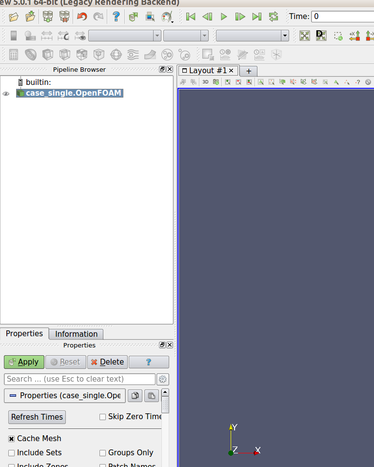
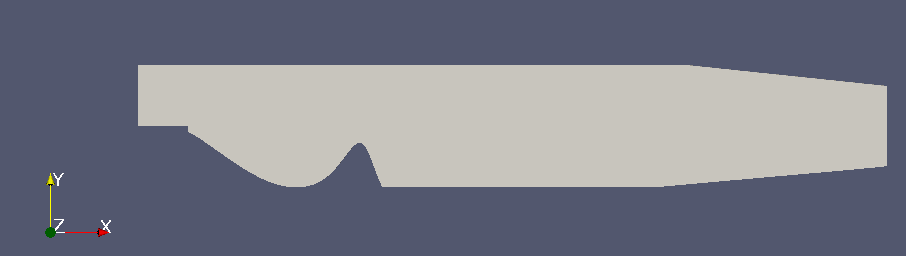
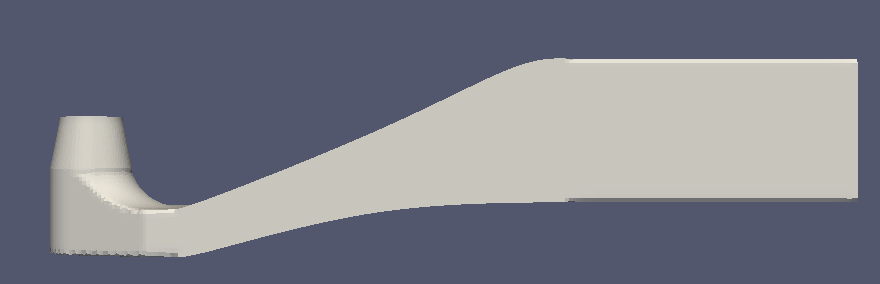
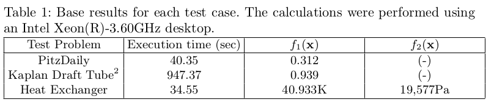

# A Suite of Computationally Expensive Shape Optimisation Problems Using Computational Fluid Dynamics
[S. Daniels](http://emps.exeter.ac.uk/computer-science/staff/sd475), [A. Rahat](http://emps.exeter.ac.uk/computer-science/staff/aamr201), [R. Everson](http://emps.exeter.ac.uk/computer-science/staff/reverson), [G. Tabor](http://emps.exeter.ac.uk/engineering/staff/grtabor) and [J. Fieldsend](http://emps.exeter.ac.uk/computer-science/staff/jefields).   
[University of Exeter, UK](http://emps.exeter.ac.uk/).

> This repository contains Python code for the test problems presented in __A Suite of Computatinally Expensive Shape Optimisation Problems Using Computational Fluid Dynamics__ by S. Daniels, A. Rahat, R. Everson, G. Tabor and J. Fieldsend, to appear in PPSN 2018 proceedings. Please refer to the _LICENSE_ before using the code.

> Preprint repository: http://hdl.handle.net/10871/33078

## Prerequisites.

* At this point in time, the software works on Linux. We think it should work on MacOS, but we have not tested it yet. We are working on making it available for other platforms. Please check this repository for updates on the topic.

* We used [OpenFOAM](https://www.openfoam.com/) to perform computational fluid dynamic simulations. It is an open source CFD software. You can download and install it on your machine for free. Please use the instructions form the following website: [https://openfoamwiki.net/index.php/Installation](https://openfoamwiki.net/index.php/Installation)

* For two test problems -- Kaplan Duct and Heat Exchanger -- we have used the [cfMesh](http://sourceforge.net/projects/cfmesh/) library. This is a utility for mesh generation which is based on Open Foam. To install the software, please follow the steps below. 

```
$ cd desired_directory
$ wget https://sourceforge.net/projects/cfmesh/files/v1.1.2/cfMesh-v1.1.2.tgz
$ tar zxvf cfMesh-v1.1.2.tgz
$ cd cfMesh-v1.1.2/
$ chmod u+x ./Allwmake
$ ./Allwmake
```

* We used Python3 to develop this benchmark suite; we recommend using [Anaconda](https://www.anaconda.com/download/) distribution for ease. To use the suite, the following modules must be installed. 
    *  [numpy](http://www.numpy.org/)
    *  [matplotlib](https://matplotlib.org/)
    *  [PyFoam](https://pypi.org/project/PyFoam/) (note that we have tested the code with PyFoam version 0.6.6)
    *  [numpy-stl](https://pypi.org/project/numpy-stl/)
    *  [deap](https://github.com/DEAP/deap)
    *  [scipy](https://www.scipy.org/)
  
    To install a module, please issue the following command from your command line. 

    `$ pip install module_name`

## Getting started.

We suggest that you clone the repository. You can do so with the following commands. 

```
$ cd your_directory_of_choice
$ git clone git@bitbucket.org:arahat/cfd-test-problem-suite.git
$ cd cfd-test-problem-suite/ 
```

You must then compile the custom problem specific OpenFOAM CFD solvers. To do so, please follow the steps below. 

```
$ of4x # load your OpenFOAM installation using alias
$ cd Exeter_CFD_Problems/data/PitzDaily/solvers 
$ chmod u+x ./Allmake
$ ./Allmake
$ cd ../../../..
$ cd Exeter_CFD_Problems/data/KaplanDuct/solvers
$ chmod u+x ./Allmake
$ ./Allmake
$ cd ../../../..
$ cd Exeter_CFD_Problems/data/HeatExchanger/solvers
$ chmod u+x ./Allmake
$ ./Allmake
```

You should now be in the main directory of the test problem suite. You can run all the test problems from here; see the section below on how to use the demonstration script.

## Demonstration of the benchmark problems. 

In this repository, we have a suite of three benchmark test problems. They are:

1. PitzDaily (single objective -- minimisation)
2. KaplanDuct (single objective -- maximisation)
3. HeatExchanger (two-objective -- maximise first and minimize second)

We have a demonstration script to easily illustrate how to run each problem. The script is called 'sample_script.py' and it lives in the main directory. In this script, we first instantiate the appropriate object that encapsulates a problem with required settings (more on this later). We then use the method **problem.get_decision_boundary()** to find the lower and upper bounds of the decision space. Using these boundaries, we generate $1000$ random solutions and check which ones are feasible with the method **problem.constraint(x)** where **x** is a decision vector. We then evaluate one of the randomly generated feasible decision vector to demonstrate how the problems may be run. 
You can use the script with the following steps.

```
$ cd your_directory_of_choice/cfd-test-problem-suite/ 
$ of4x # use the alias for your OpenFOAM installation
$ ipython
In [1]: run sample_script.py -h # to see the help documentation
```
This will produce the following output:

```
This is a sample script that demonstrates how to run the test problems. The parameters may be configured with following arguments.
'-p': Mandatory argument that defines the problem name. The options are: 'PitzDaily', 'KaplanDuct' and 'HeatExchanger'
'-v': The CFD simulations under the bonnet produces a lot of text to show status of the simulation. We have tried to suppress many of these, but if you would like to see some of what is going on, please provide this argument.
```

To run the demonstration, you can use the following commands.

```
In [2]: run sample_script.py -p PitzDaily
In [3]: run sample_script.py -p KaplanDuct
In [4]: run sample_script.py -p HeatExchanger
In [4]: run sample_script.py -p ESP ## Missing so far!!!
```

If all of these ran successfully, you should be able to inspect visually what was the shape that was generated. See the section below for details of visualisation. 

### Visualising a solution. 

#### PitzDaily.

Once a solution has been evaluated, you can inspect the solution visually. To do so, follow the steps below. 

```
$ cd Exeter_CFD_Problems/data/PitzDaily/case_single/ # this is the case_path attribute in the settings.
$ of4x
$ paraFoam 
```

If the above ran successfully, you should see the ParaView window (see below). At the bottom left of the window, in properties bar, you should see an **Apply** button. 



Pressing the **Apply** should show the shape that was generated using the provided decision vector.



To further inspect the geometry, please refer to the [ParaView Guide](https://www.paraview.org/paraview-guide/).

#### KaplanDuct.

Similar to PitzDaily, once a solution has been evaluated, you can inspect the solution visually. To do so, use the following directory in step 1, and the rest of the steps are the same. 

```
$ cd Exeter_CFD_Problems/data/Kaplan/case_single/ # this is the case_path attribute in the settings.
```

Again, you now should see the ParaView window. At the bottom left of the window, in properties bar, press the **Apply** button and you should see the shape generated from the decision vector:



#### HeatExchanger.

Similar to PitzDaily and KaplanDuct, once a solution has been evaluated, you can inspect the solution visually. To do so, initiate the paraFoam session from the following directory.

```
$ cd Exeter_CFD_Problems/data/HeatExchanger/case_multi/ # this is the case_path attribute in the settings.
```

Again, you now should see the ParaView window. At the bottom left of the window, in properties bar, press the **Apply** button and you should see the shape generated from the decision vector:


## Using your optimiser.

Looking through the *sample_script.py* will give you an idea on how to use the test problem. However, there is a lot more that you could do with the code and set various parameters. Here we will discuss the use of the suite further. 

To use your optimiser with one of the problems, you would need to copy the 'Exeter_CFD_Problems' to where you would like to run your optimiser:

```
$ cp -r your_directory_of_choice/cfd-test-problem-suite/Exeter_CFD_Problems your_optimiser_directory/
```

There are three classes that encapsulate the test problems: 'PitzDaily', 'KaplanDuct' and 'HeatExchanger'. All of them have configurable parameters which can be set with a dictionary. Below we will go through the configurable setting for each problem in turn. 

#### PitzDaily. 

We will start with changing directory to where *Exeter_CFD_Problems* is, and import the problems in python.

```
$ cd your_optimiser_directory
$ of4x # load your OpenFOAM installation
$ ipython
In [1]: import Exeter_CFD_Problems as TestSuite
```

We will then prepare a dictionary for the configurable parameters. 

```
In [2]: settings = {}
```

All problems have a source case directory with appropriate settings and this gets copied into a destination directory where the case is run. For PitzDaily the settings are as follows. 

```
In [3]: settings['source_case'] = 'Exeter_CFD_Problems/data/PitzDaily/case_fine/' # this is the source directory
In [4]: settings['case_path'] = 'Exeter_CFD_Problems/data/PitzDaily/case_single/' # this is the case path where CFD simulations will run
```

As PitzDaily uses splines within a predefined area, we now need to define the boundary of the modifiable area within the geometry and also the fixed points of the splines. 

```
In [5]: settings['boundary_files'] = ['Exeter_CFD_Problems/data/PitzDaily/boundary.csv']
In [6]: settings['fixed_points_files'] = ['Exeter_CFD_Problems/data/PitzDaily/fixed.csv']
```

For PitzDaily, we use only 5 control points by default. However, you can change it with the following option. 

```
In [7]: settings['n_control'] = [5] # you should be able to use any positive integer.
```

Note that, every control point has two elements in the decision vector: horizontal and vertical positions. An increase or decrease therefore either adds or removes two dimensions in the decision vector. For a high dimensional decision vector, many randomly generated decision vector may result in an infeasible solution. With 5 control points, roughly 30% randomly generated solutions are likely to be feasible. Increasing the number of control points is likely to decrease the chance of getting a feasible solution at random.

You are now ready to create an instance of the PitzDaily object. 

```
In [8]: prob = TestSuite.PitzDaily(settings)
```

This will allow you to inquire the box constraints of the decision space. You should be able to use this to generate random decision vectors; see the *sample_script.py* for more details. 

```
In [9]: lb, ub = prob.get_decision_boundary() # lb = lower bounds, ub = upper bounds
```

Once you have a tentative decision vector, you should check whether it is valid or not. 

```
In [10]: is_valid = prob.constraint(x)
```
Note that your decision vector x needs to be a 1D numpy array. If `is_valid` is `True`, then  you can run CFD simulation with the generated shape. You can evaluate the solution in the following fashion. 

```
In [11]: res = prob.evaluate(x, verbose=False)
```

Note here setting `verbose = True` will result in the CFD simulator printing a bit more text about the simulation.

#### KaplanDuct

To work with this problem, you need the following mandatory settings. 

```
In [12]: settings = {
            'source_case': 'Exeter_CFD_Problems/data/KaplanDuct/case_fine/',
            'case_path': 'Exeter_CFD_Problems/data/KaplanDuct/case_single/',
            'boundary_files': ['Exeter_CFD_Problems/data/KaplanDuct/boundary_1stspline.csv', \
                                'Exeter_CFD_Problems/data/KaplanDuct/boundary_2ndspline.csv'],
            'fixed_points_files': ['Exeter_CFD_Problems/data/KaplanDuct/fixed_1.csv',\
                                'Exeter_CFD_Problems/data/KaplanDuct/fixed_2.csv']
          }
```

Here, we have two splines instead of one. That is why we had to provide two files each for boundary and fixed point definitions. We used a single control point for both splines, but you can change it using the following code: 

```
In [13]: settings['n_control'] = [1, 1] # you should be able to use any positive integer.
```

As you can see, here we have supplied two integers for the number of control points: one for each splines. With one control point per splines, we expect there is approximately 25% chance of getting a feasible solution at random. 

You can now create an instance of the KaplanDuct object and use that to evaluate a decision vector; again make sure your decision vector is feasible. 

```
In [14]: prob = TestSuite.KaplanDuct(settings) 
In [15]: prob.evaluate(x)
```

#### HeatExchanger.

It is again very similar to the other problems. However, we do not need any boundary or fixed point information here as there are no splines to work with. The mandatory settings in this case are as follows. 

```
In [16]: settings = {
            'source_case': 'Exeter_CFD_Problems/data/HeatExchanger/heat_exchange/',
            'case_path': 'Exeter_CFD_Problems/data/HeatExchanger/case_multi/'
         }
```

To change the problem dimensions, the following settings may be altered. 

```
In [17]: settings['n_coeffs_radii'] = [2, 2, 2]
In [18]: settings['n_coeffs_num'] = 4
In [19]: settings['n_betas'] = [2, 2, 2]
```

Now, we will take a moment to describe what these parameters achieve and how that impact the dimension of the decision space. We used parametric functions, e.g. Chebyshev and weighted monotonic Beta CDFs (WMB; see paper for details), to represent a geometry. A set of parameters produces a distinct shape. We have flexibility in how many parameters we would like to use for these parametric functions, and the arguments above help us define the number of parameters. 

We have three rows of pipes going across the domain. A Chebyshev function controls the radii of the pipes in each row. In `In [17]`, we define how many coefficients for this in each row. We have just one Chebyshev function controlling the number of pipes in each row. The number of coefficients is determined in `In [18]`. In addition, we used one WMB function per row to  represent the position of the pipes. The numbers in `In [19]` defines how many Beta CDFs are included in each WMB per row (hence three numbers are required).

The coefficients of the Chebyshev functions are directly incorporated in the decision vector. As such increasing any one of them directly increases the decision vector dimension. On the other hand, each WMB has three vectors associated with them: one vector of weights, one vector of $\alpha$ and a vector of $\beta$ parameters. These parameters are varied within a decision vector. So, increasing the the number of Beta CDFs included in a WMB increases the decision vector dimension by three. 

With the default values, we expect there is a chance of approximately 70% of getting a feasible solution at random (generated while satisfying the box constraints).

Furthermore, you can also change how many pipes are allowed in each row using the following arguments. 

```
In [20]: settings['min_num_pipes_per_row'] = 1
In [21]: settings['max_num_pipes_per_row'] = 3
```

Changing these parameters have no impact on the decision vector size. Nonetheless, this alters the problem complexity (as in how difficult it becomes to solve), and we are yet to fully investigate how this impacts the complexity of the problem.

#### Electrostatic Precipitator (ESP)
Electrostatic Precipitators (ESPs) are one of the main components of gas cleaning systems. 
They are used in large scale power plants or other industries where solid particles have to be removed from a gas stream. 
ESPs are large devices with dimensions of around 30m × 30m × 50m, resulting in very high building cost. 
The main task of an ESP is to separate and extract particles from exhaust gases in order to reduce environmental pollution. 

 

In the flue gas inlet hood of an ESP, a gas distribution system (GDS) is required to control and guide the gasflow through separation zones,
in which particles are removed from the exhaust gases. 

If no GDS is used, or if the system is configured poorly, the fast inlet gas stream will rush through the separation zones of the ESP. 
This results in very low separation efficiencies. 
In case of a well configured GDS, the inflowing gas is nicely distributed across the whole surface of the separation zones, resulting in high efficiency. 
Hence, the efficient operation of an ESP requires an optimal configuration of the GDS. 

The task in this test problem is to optimally configure the total of 49 slots in the GDS.
Each of the slots can be configured with baffles, as well as blocking and perforated plates. 
Baffles are metal plates which are mounted at an angle to the general gas flow. 
They are used to redirect a gas stream into a new direction. Blocking plates completely block a gas stream. 
Perforated plates are used to slow down and only partially block gas streams. 
Optionally, some slots can also be left empty.
Each of these options is represented with an integer value (0-7). 
Therefore the decision vector for the ESP-Problem consists of 49 discrete values e.g.:

'1,1,0,1,0,0,0,0,0,4,3,4,6,6,5,6,7,7,6,2,4,7,2,0,4,0,0,1,6,0,0,3,6,7,2,6,7,0,4,1,6,7,2,7,0,4,4,2,7'

## Presenting your results. 

We have ran these problems on our machines for the base shape, and we got the following results. 



You should compare your results with these results: in particular the objective function value that your optimiser achieved. It would be a good idea to also mention which version of the code you used. You should be able to find out the version with the following code: 

```
In [a]: import Exeter_CFD_Problems as TestSuite
In [a+1]: print(TestSuite.__version__)
```

The very first version that was released was: 1.0. 

#### Version history. 

1. Version 1.0: the first version to be released for public consumption (AR and SD). 
2. Version 1.1: the version to be released with docker and additional problem (FR).
3. Version 1.2: we have fixed a bug (b1 below) in the heat exchanger case (AR and SD). 

## Known Issues and FAQ.

* I am trying to run the sample script and I see the following error:

```
---------------------------------------------------------------------------
ImportError                               Traceback (most recent call last)
~/Dropbox/repo/cfd-test-problem-suite/Exeter_CFD_Problems/pitzdaily.py in <module>()
      1 try:
----> 2     from data.SnappyHexOptimise import BasicPitzDailyRun
      3 except:

ImportError: No module named 'data'
```

=> This happens when the correct OpenFOAM environment has not been loaded. Please load it by issuing appropriate alias, e.g. ```$ of4x```. 

* I see the following text (and other text) while evaluating a solution (running CFD simulation). Can I ignore them?

```
Getting LinuxMem: [Errno 2] No such file or directory: '/proc/14492/status'
```

=> Yes, you can safely ignore these texts. Usually, developers choose to print a lot of text while running CFD simulations. We have suppressed such texts as much as possible for your convenience. However, some text may appear, and we will work on stopping it in future.

* Repeated evluation of the KaplanDuct problem results in slightly different results for the same decision vector. Is this expected? 

=> Yes. In version 1.0, we can achieve an accuracy of up to 5 decimal places. Please note that when you present your results. We are working on this to improve the accuracy. 

* I tried to install cfMesh with of4x (64 bit), but the installation failed. What should I do? [15 May 2020]

=> After a recent update, cfMesh does not seem to work with the 64 bit installation. If you face this issue, please try 32 bit version of OpenFOAM. 

## Setup via Docker
Additionally to the manual installation of the benchmark suite, a docker implementation is available through which the simulations can be run.

### Docker installation
In order to use the container version of the benchmark suite docker has to be installed. 
Download and install docker from the official website:
https://www.docker.com/products/docker-desktop

### Using the container 
After the installation the container can be used for evaluating CFD simulations.
Each simulation can be started via the docker run command. The first evaluation will also download the container image and thus take longer to execute.
The general call is build up as follows:

The container is started and the dockerCall.sh script is executed. 

```
docker run --rm frehbach/cfd-test-problem-suite ./dockerCall.sh
```
The problem name has to be specified as the next parameter. 
Lastly, the candidate solution which shall be simulated has to be specified by a comma seperated list of numbers surrounded by single 's. 
For example, an evaluation can be executed like this: 

**(Note that these commands should be on a single line!)**

```
docker run --rm frehbach/cfd-test-problem-suite ./dockerCall.sh PitzDaily 
    '0.11063283,-0.03252882,0.0333295,-0.02732676,0.07319029,0.00579979,0.08095974,-0.04046204,0.06019682,-0.01585734'
    
docker run --rm frehbach/cfd-test-problem-suite ./dockerCall.sh KaplanDuct 
    '2166.43098447,-671.52102819,2377.333286,-69.16966251'
    
docker run --rm frehbach/cfd-test-problem-suite ./dockerCall.sh HeatExchanger 
    '-0.89232652,0.03599114,0.7075494,-0.24789502,3.72886442,3.11245792,8.70912195,8.31955523,0.84670057,
    0.7638816,-0.49889754,0.32321096,6.62711066,6.89689518,8.22022831,8.50896155,0.56366081,0.53639077,
    -0.53977858,-0.69141556,3.83963371,2.83172664,0.88267636,2.35745137,0.73458725,0.79221888,0.53419005,-0.217558'
    
docker run --rm frehbach/cfd-test-problem-suite ./dockerCall.sh ESP 
    '1,1,0,1,0,0,0,0,0,4,3,4,6,6,5,6,7,7,6,2,4,7,2,0,4,0,0,1,6,0,0,3,6,7,2,6,7,0,4,1,6,7,2,7,0,4,4,2,7'
```

Examples for the programming languages R and Python can be found in the directory DockerExampleScripts.
Implementations in other programming languages would be greatly appreciated and can be sent in via mail or pull request.

## Bug reports. 

* [b1] We have been able to identify a bug in heat exhcanger problem. We are actively fixing this. Please keep an eye here for an update. 

=> This is now fixed. 

## Contact us.

If you have any issues with this test suite, please contact one of the following. 

* [S. Daniels](mailto:s.daniels@exeter.ac.uk) (for CFD issues)
* [A. Rahat](mailto:a.a.m.rahat@exeter.ac.uk) (for general code and representation issues)
* [F. Rehbach](mailto:frederik.rehbach@th-koeln.de) (for Docker issues)
